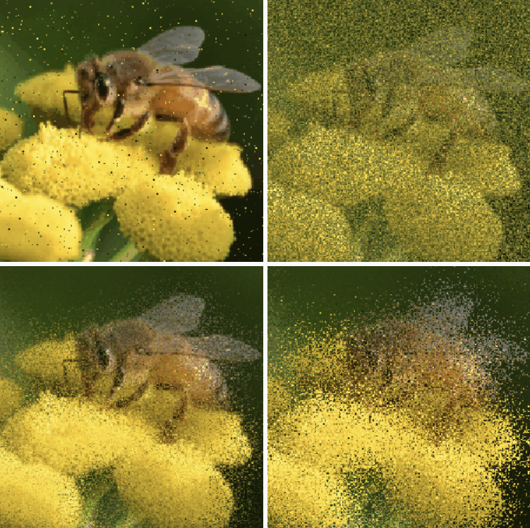
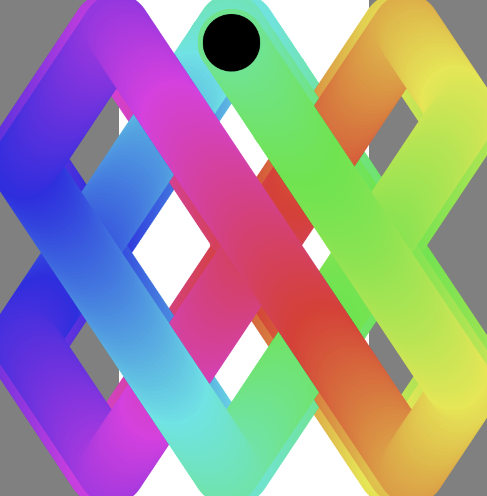

### Part 1: Imaging Technique Inspiration
I think it would be fun to create an artwork using different **colour** and **animation** techniques. 
An interesting idea would be to generate the colour of the artwork based on a picture, like this example 
https://happycoding.io/tutorials/p5js/images/image-palette

Once the colours are generated, we can orbit inside the world ~ 
https://p5js.org/examples/3d-orbit-control/

~ or do pixel-related animations!
https://happycoding.io/tutorials/p5js/images/pixel-swapper 

It would be nice to get a chance to be creative and build a world that you can navigate and explore in detail!

### Part 1: Coding Technique Inspiration

The code to the image pallette generation and pixel swapping is provided in the above links.

We could also make it more interactive for the user by using Conditions - like if-else, or switch statements for different use cases and create variety in the pattern based on different user-clicks. Here's an example, along with the code - 
https://p5js.org/examples/animation-and-variables-conditions/

Excited to see what we can create! :D
